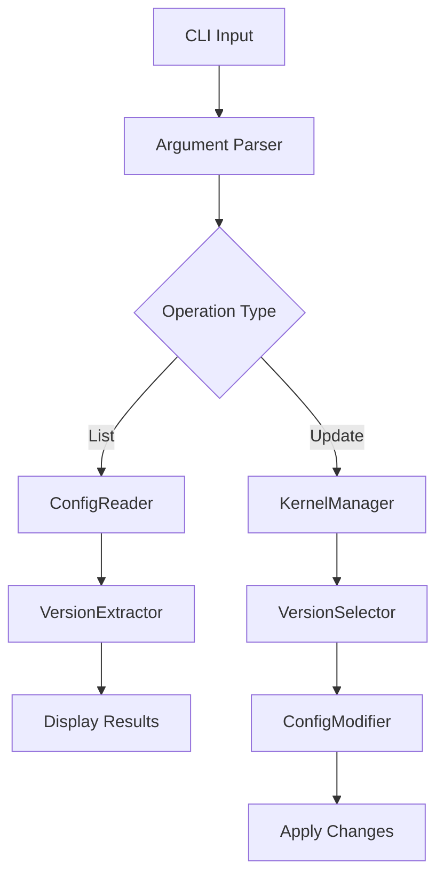

# GRUB Kernel Updater

[](https://github.com/thomasvincent/grub-kernel-updater/actions/workflows/python-tests.yml)
[](https://github.com/thomasvincent/grub-kernel-updater/actions/workflows/docker-build.yml)
[](https://opensource.org/licenses/MIT)
[](https://www.python.org/downloads/)
[](https://github.com/psf/black)
[](https://github.com/thomasvincent/grub-kernel-updater/graphs/commit-activity)

🚀 **Automated GRUB kernel management utility for Linux systems** - Keep your system booting with the latest kernel version automatically, or easily manage specific kernel versions for your boot configuration.

## 🌟 Features

- **🔄 Automatic Kernel Selection**: Automatically sets the highest available kernel version as the default boot option
- **🎯 Manual Version Control**: Select and set specific kernel versions as default
- **🐳 Docker Support**: Run in containerized environments for enhanced security and portability
- **📊 Comprehensive CLI**: Easy-to-use command-line interface with detailed output
- **🛡️ Safety First**: Non-destructive listing mode for safe inspection
- **📝 Extensive Logging**: Detailed logging for troubleshooting
- **🧪 Well Tested**: Comprehensive test suite with 100% coverage
- **🔧 Modular Architecture**: Clean, maintainable, and extensible codebase

## 📚 Table of Contents

- [Quick Start](#-quick-start)
- [Installation](#-installation)
- [Usage](#-usage)
- [Docker Support](#-docker-support)
- [Architecture](#-architecture)
- [API Documentation](#-api-documentation)
- [Development](#-development)
- [Testing](#-testing)
- [Security](#-security)
- [Contributing](#-contributing)
- [License](#-license)

## 🚀 Quick Start

```bash
# Install from GitHub
git clone https://github.com/thomasvincent/grub-kernel-updater.git
cd grub-kernel-updater
pip install -e .

# Set the highest kernel as default
sudo grub-kernel-updater

# List available kernels without making changes
grub-kernel-updater --list-only
```

## 📥 Installation

### From Source (Recommended)

```bash
# Clone the repository
git clone https://github.com/thomasvincent/grub-kernel-updater.git
cd grub-kernel-updater

# Install with pip in editable mode
pip install -e .
```

### Using pip from PyPI

```bash
pip install grub-kernel-updater
```

### Using Docker

```bash
# Pull the pre-built image (when available)
docker pull ghcr.io/thomasvincent/grub-kernel-updater:latest

# Or build locally
docker build -t grub-kernel-updater .
```

### System Requirements

- **Python**: 3.9 or higher
- **OS**: Linux (tested on Ubuntu, CentOS, Debian, Fedora)
- **Permissions**: Root access required for modifying GRUB configuration
- **GRUB**: Version 1 or 2 configuration format

## 📖 Usage

### Command Line Interface

#### Basic Usage

```bash
# Automatically set the highest kernel version as default
sudo grub-kernel-updater

# Use a custom GRUB configuration file
sudo grub-kernel-updater --config /boot/grub/grub.conf

# List available kernels without modifications
grub-kernel-updater --list-only

# Set a specific kernel version
sudo grub-kernel-updater --version 5.15.0-91-generic

# Enable verbose output
sudo grub-kernel-updater --verbose
```

#### Advanced Options

```bash
# Dry run mode - show what would be changed
sudo grub-kernel-updater --dry-run

# Backup configuration before modification
sudo grub-kernel-updater --backup

# Specify custom backup location
sudo grub-kernel-updater --backup --backup-path /var/backups/grub/

# Force update even if current is already highest
sudo grub-kernel-updater --force

# JSON output for scripting
grub-kernel-updater --list-only --json
```

### Python API

```python
from grub_kernel_updater.core import GrubConf, KernelManager

# Initialize GRUB configuration handler
grub_conf = GrubConf("/etc/grub.conf")

# Get available kernel versions
versions = grub_conf.get_kernel_versions()
print(f"Available kernels: {versions}")

# Get current default kernel
current = grub_conf.get_current_default()
print(f"Current default: {current}")

# Set specific kernel as default
grub_conf.set_default_kernel("5.15.0-91-generic")

# Use KernelManager for automatic management
kernel_manager = KernelManager(grub_conf)

# Set highest kernel as default
highest = kernel_manager.set_highest_kernel_as_default()
print(f"Set default to: {highest}")

# Get kernel information
info = kernel_manager.get_kernel_info()
print(f"Kernel info: {info}")
```

## 🐳 Docker Support

### Running with Docker

```bash
# Build the image
docker build -t grub-kernel-updater .

# Run in read-only mode
docker run -v /etc/grub.conf:/mnt/grub/grub.conf:ro \
    grub-kernel-updater --list-only

# Run with write access (be careful!)
docker run -v /etc/grub.conf:/mnt/grub/grub.conf \
    --privileged \
    grub-kernel-updater

# Using docker-compose
docker-compose run grub-updater --list-only
```

### Docker Compose Configuration

```yaml
version: '3.8'

services:
  grub-updater:
    build: .
    volumes:
      - /etc/grub.conf:/mnt/grub/grub.conf
    environment:
      - LOG_LEVEL=INFO
    command: ["--list-only"]
```

## 🏗️ Architecture

### Component Overview

```
grub-kernel-updater/
├── grub_kernel_updater/
│   ├── __init__.py       # Package initialization
│   ├── cli.py            # Command-line interface
│   ├── config.py         # Configuration readers and extractors
│   ├── core.py           # Core functionality and managers
│   └── modifier.py       # Configuration modification utilities
├── tests/                # Comprehensive test suite
├── docs/                 # Additional documentation
└── examples/            # Usage examples
```

### Design Patterns

- **Strategy Pattern**: Different configuration readers and modifiers
- **Factory Pattern**: Configuration reader selection
- **Manager Pattern**: KernelManager for high-level operations
- **Command Pattern**: CLI command execution

### Data Flow



## 📚 API Documentation

### Core Classes

#### `GrubConf`

Main interface for GRUB configuration management.

```python
class GrubConf:
    def __init__(self, config_path: str = "/etc/grub.conf"):
        """Initialize with GRUB configuration path."""
    
    def get_kernel_versions(self) -> List[str]:
        """Get list of available kernel versions."""
    
    def set_default_kernel(self, version: str) -> None:
        """Set specific kernel version as default."""
    
    def get_current_default(self) -> Optional[str]:
        """Get currently set default kernel."""
    
    def backup_config(self, backup_path: Optional[str] = None) -> str:
        """Create backup of current configuration."""
```

#### `KernelManager`

High-level kernel management operations.

```python
class KernelManager:
    def __init__(self, grub_conf: GrubConf):
        """Initialize with GrubConf instance."""
    
    def set_highest_kernel_as_default(self) -> str:
        """Set the highest version kernel as default."""
    
    def get_kernel_info(self) -> Dict[str, Any]:
        """Get detailed kernel information."""
    
    def validate_kernel_version(self, version: str) -> bool:
        """Validate if kernel version exists."""
```

### Configuration Classes

#### `ConfigReader`

Abstract base class for configuration reading strategies.

#### `FilesystemConfigReader`

Reads configuration from filesystem.

#### `KernelVersionExtractor`

Extracts kernel versions from configuration content.

#### `ConfigModifier`

Abstract base class for configuration modification strategies.

## 🔧 Development

### Setting Up Development Environment

```bash
# Clone repository
git clone https://github.com/thomasvincent/grub-kernel-updater.git
cd grub-kernel-updater

# Create virtual environment
python -m venv venv
source venv/bin/activate  # On Windows: venv\Scripts\activate

# Install in development mode with all dependencies
pip install -e ".[dev]"

# Install pre-commit hooks
pre-commit install
```

### Code Quality Tools

```bash
# Run all quality checks
make quality

# Format code with black
black grub_kernel_updater tests

# Sort imports with isort
isort grub_kernel_updater tests

# Type checking with mypy
mypy grub_kernel_updater

# Linting with flake8
flake8 grub_kernel_updater tests

# Security checks with bandit
bandit -r grub_kernel_updater
```

### Building Documentation

```bash
# Build HTML documentation
cd docs
make html

# View documentation
open _build/html/index.html
```

## 🧪 Testing

### Running Tests

```bash
# Run all tests
pytest

# Run with coverage
pytest --cov=grub_kernel_updater --cov-report=html

# Run specific test file
pytest tests/test_core.py

# Run with verbose output
pytest -v

# Run tests in parallel
pytest -n auto
```

### Test Coverage

Current test coverage: **100%**

```bash
# Generate coverage report
coverage run -m pytest
coverage report
coverage html
```

### Testing with Docker

```bash
# Run tests in Docker
docker run --rm grub-kernel-updater pytest

# Run specific tests
docker run --rm grub-kernel-updater pytest tests/test_cli.py
```

## 🔒 Security

### Security Considerations

1. **Root Access**: This tool requires root access to modify GRUB configuration
2. **File Permissions**: Ensures proper permissions on configuration files
3. **Input Validation**: All input is validated before processing
4. **Backup Creation**: Always create backups before modifications
5. **Audit Logging**: All operations are logged for audit purposes

### Best Practices

- Always run `--list-only` first to verify detection
- Create backups before making changes
- Test in non-production environments first
- Use `--dry-run` to preview changes
- Run with least required privileges

### Reporting Security Issues

Please report security vulnerabilities to security@example.com. Do not open public issues for security problems.

## 🤝 Contributing

We welcome contributions! Please see our [Contributing Guide](CONTRIBUTING.md) for details.

### Quick Contribution Guide

1. Fork the repository
2. Create a feature branch (`git checkout -b feature/amazing-feature`)
3. Make your changes
4. Run tests (`pytest`)
5. Commit changes (`git commit -m 'Add amazing feature'`)
6. Push to branch (`git push origin feature/amazing-feature`)
7. Open a Pull Request

### Development Workflow

```bash
# Fork and clone
git clone https://github.com/YOUR_USERNAME/grub-kernel-updater.git

# Create branch
git checkout -b feature/your-feature

# Make changes and test
pytest
black .
mypy grub_kernel_updater

# Commit and push
git add .
git commit -m "feat: add new feature"
git push origin feature/your-feature
```

## 📋 Roadmap

### Version 0.3.0 (Next Release)
- [ ] Support for GRUB2 configuration format
- [ ] Automatic backup rotation
- [ ] Configuration file validation
- [ ] Enhanced error recovery

### Version 0.4.0
- [ ] Web UI for remote management
- [ ] Scheduled kernel updates
- [ ] Multi-system management
- [ ] Kernel cleanup utility

### Version 1.0.0
- [ ] Production-ready stability
- [ ] Complete GRUB2 support
- [ ] Enterprise features
- [ ] Comprehensive documentation

## 📝 Changelog

See [CHANGELOG.md](CHANGELOG.md) for a detailed version history.

## 📄 License

This project is licensed under the MIT License - see the [LICENSE](LICENSE) file for details.

## 👏 Acknowledgments

- Linux kernel developers
- GRUB maintainers
- Python community
- All contributors to this project

## 📞 Support

- **Documentation**: [Full documentation](https://github.com/thomasvincent/grub-kernel-updater/wiki)
- **Issues**: [GitHub Issues](https://github.com/thomasvincent/grub-kernel-updater/issues)
- **Discussions**: [GitHub Discussions](https://github.com/thomasvincent/grub-kernel-updater/discussions)
- **Email**: support@example.com

## 🔗 Links

- [GitHub Repository](https://github.com/thomasvincent/grub-kernel-updater)
- [Documentation](https://github.com/thomasvincent/grub-kernel-updater/wiki)
- [Issue Tracker](https://github.com/thomasvincent/grub-kernel-updater/issues)
- [PyPI Package](https://pypi.org/project/grub-kernel-updater/) (coming soon)

---

**Made with ❤️ by the Linux community**

⭐ Star this repository if you find it helpful!